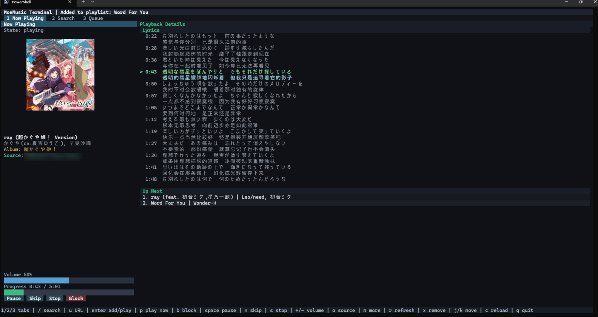
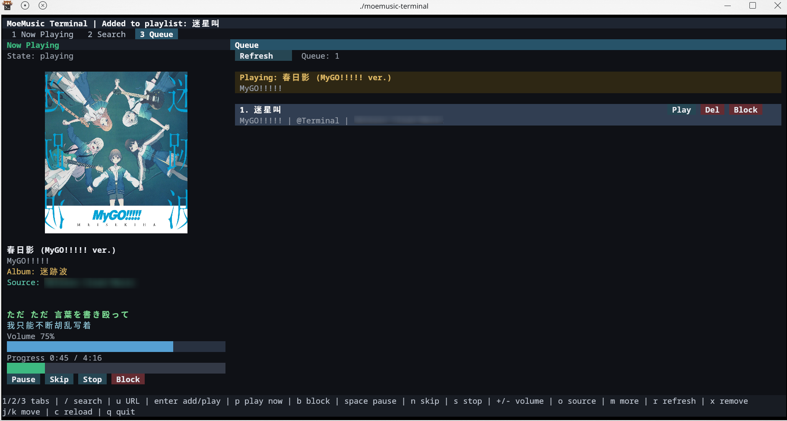
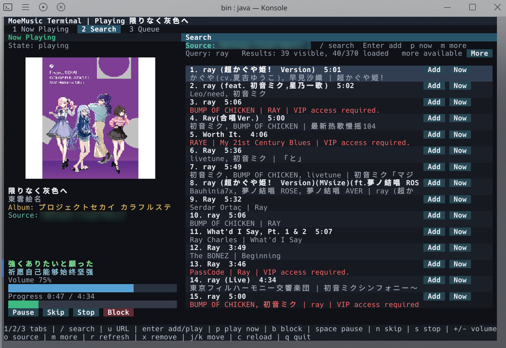

# MoeMusic Terminal

简体中文 | [English](./README.md)

> [!WARNING]
> 本项目处于实验性质，不建议在生产环境使用。本项目所有代码均由 AI 生成，且仅进行了人工测试，未进行任何代码审计（仅排除了不明第三方依赖）。在处理不可信的音频或图片文件时，可能存在安全风险。

MoeMusic Terminal 是一个面向 [MoeMusic](https://github.com/lolicode-org/MoeMusic) 运行时的轻量级独立单用户终端客户端。

虽然 MoeMusic 核心库设计为高度抽象且平台无关，但其开发初衷主要是为了 `MoeMusic-Minecraft` 模组。本项目作为一个完全脱离 Minecraft 环境的概念验证（POC）实现，旨在满足作者个人的本地播放器需求。由于作者不具备 UI 设计能力，因此界面较为简陋。

## 运行截图

<details>
<summary>点击展开</summary>

Windows Terminal


Linux Kitty


Linux Konsole


</details>

## 功能特性

- **终端用户界面（TUI）**：基于 Lanterna 构建。
- **配置管理**：配置文件在 `moemusic.toml` 自动生成，需通过外部编辑器进行修改。
- **Java Sound 播放**：音频输出使用 Java Sound 代替 OpenAL，避免了复杂的本地原生库依赖。
- **单进程桥接**：服务端与客户端通过内存数据包桥进行通信，确保了标准请求与播放协议的正常运行。
- **插件支持**：可将自定义音源或插件的 JAR 文件放置于 `<config-dir>/plugins/` 目录中以扩展功能。

## 安装与运行

### 使用 Gradle 直接运行
在开发模式下启动：
```bash
./gradlew run
```

### Linux / macOS
为了在真实的文本终端中运行，请避免直接使用 `gradle run`。Gradle 可能会在没有控制终端（`/dev/tty`）的情况下启动 JVM，而类 Unix 系统下的 Lanterna 需要该终端。请构建分发包并运行生成的脚本：
```bash
./gradlew installDist
./build/install/moemusic-terminal/bin/moemusic-terminal
```

### Windows
在 Windows 上，请从 Windows Terminal、PowerShell 或命令提示符（`cmd.exe`）中运行生成的批处理文件，以确保 JLine 后端能正确附加到当前活动控制台：
```powershell
gradlew.bat installDist
build\install\moemusic-terminal\bin\moemusic-terminal.bat
```

### Android
本项目携带的原生库已针对 Android 进行了构建，且成功运行在 Android 设备的 Termux 环境中。请按照 Linux/macOS 的安装说明进行操作。

已知 Termux 截至目前（2026-05-25）仍不支持 Sixel 图像协议，因此封面显示将降级为 Unicode 半块字符渲染。
好消息是，在我撰写本文时，Termux 开发团队已准备合并[相关补丁](https://github.com/termux/termux-app/pull/2973)，有望在下个版本中原生支持 Sixel。
届时你可以通过 `--cover sixel` 参数启用 Sixel 图像渲染，获得更好的封面显示效果。

## 命令行参数

- `--config-dir <path>`：指定配置目录。默认为各操作系统对应的用户配置目录。
- `--terminal <mode>`：显式指定终端模式（可选值：`auto`、`text` 或 `swing`）。
- `--mouse <mode>`：鼠标控制设置（可选值：`auto`、`on` 或 `off`）。鼠标支持默认设为 `auto`，且依赖于终端模拟器发送鼠标事件。
- `--cover <mode>`：封面渲染设置（可选值：`auto`、`terminal` 、`kitty`、`sixel`、`unicode` 或 `off`）。
  - 在支持 Kitty 协议或 Sixel 的终端上，封面默认渲染为终端图像。在其他终端上，则降级为 Unicode 半宽字符像素渲染。
  - 使用 `--cover kitty` 强制使用 Kitty 图像协议，使用 `--cover sixel` 强制使用 Sixel 图像协议，使用 `--cover terminal` 启用保守的终端图像检测，使用 `--cover unicode` 强制使用文本渲染，使用 `--cover off` 彻底关闭封面显示。
  - 若封面文件缺失、被客户端媒体防火墙拦截或解码失败，则降级显示占位符。

## 已知问题

- **Konsole 图片模糊**：在 Linux 的 Konsole 终端中运行时，封面图片可能会出现模糊。受限于作者的技术水平，目前该问题无法解决（尚不确定是否为 Konsole 终端自身的限制）。在 Kitty 终端中显示正常。
- **Windows Terminal 图片位置和尺寸**：在 Windows Terminal 中，封面图片可能会出现位置偏移和尺寸不正确的问题，在调整窗口大小后可能会出现超出图片尺寸的占位色块。
